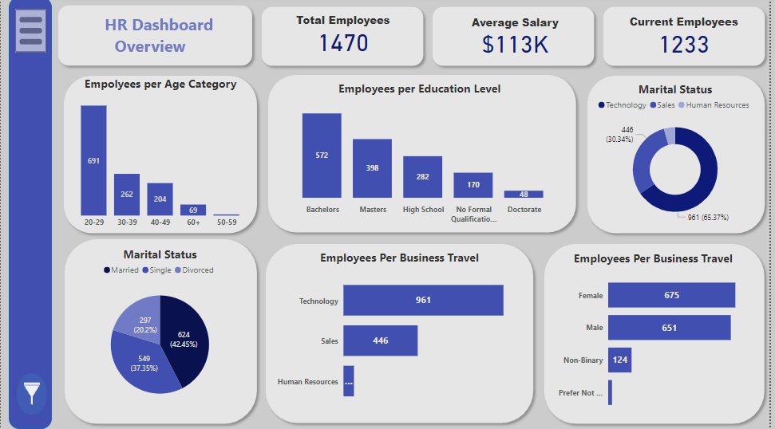
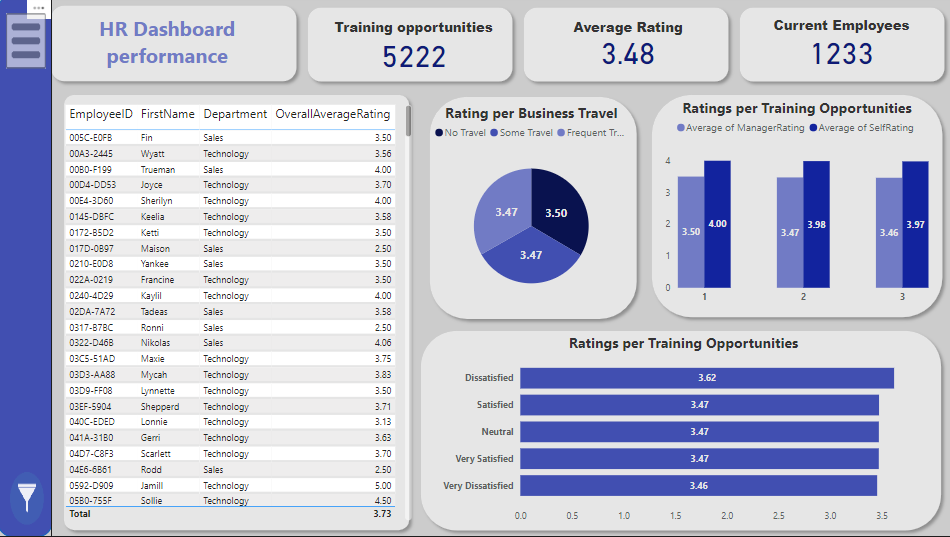
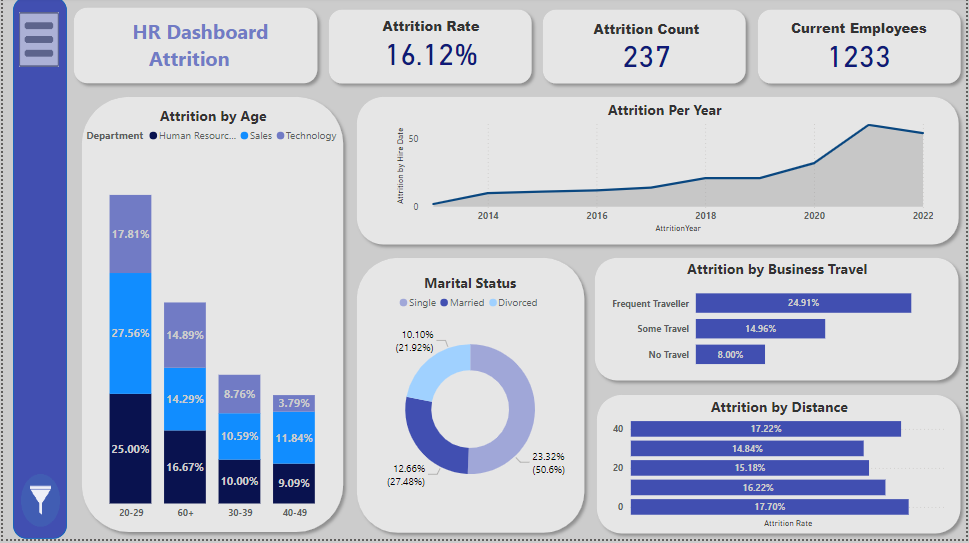

# HR Dashboard Project

### Project Overview
This project presents a series of interactive HR dashboards created in Power BI. The dashboards provide insights into various aspects of HR data, including employee demographics, performance ratings, attrition rates, and training opportunities. The goal of the project is to enable data-driven decision-making in HR by analyzing key metrics.

### Data Model
The data model is structured to efficiently connect related tables and enable smooth reporting. Key tables and their relationships include:

- **Employee**: Contains core employee information, such as age, education, department, business travel, and distance from home.
- **PerformanceRating**: Linked to the `Employee` table via `EmployeeID`, it captures various satisfaction metrics, including environment satisfaction, job satisfaction, and relationship satisfaction, as well as performance ratings and training metrics.
- **Attrition Calculations**: A table that stores calculated metrics related to employee attrition, such as attrition by job satisfaction, age category, and overall attrition count.
- **SatisfactionLevel**: Stores different satisfaction levels, linked to performance and ratings.
- **DateTable**: A date dimension table used to analyze trends over time, including attrition by year.
- **Top 10 Employees**: Contains information on top-performing employees, linked by `EmployeeID` and department.
- **EducationLevel and RatingLevel**: Dimension tables used to categorize education and rating levels.

This structure enables flexible and detailed reporting across various HR metrics, leveraging a combination of relationship connections and calculated measures.

### Key Features
- Visual breakdown of key HR metrics, including employee count, average rating, and attrition rate.
- Department-wise and demographic insights into employee performance, satisfaction, and attrition.
- Analysis of employee training opportunities and participation across different departments.

### Dashboard Pages
1. **Overview Dashboard**: 
   - Displays high-level HR metrics, including total employees, average salary, and department distributions.
   - Visuals showing employee counts by age category, education level, marital status, and business travel frequency.
     

2. **Performance Dashboard**:
   - Focuses on employee performance metrics, including ratings per department, average performance scores, and distribution of training opportunities.
   - Detailed views on performance ratings based on travel and satisfaction level.
     

3. **Attrition Dashboard**:
   - Provides insights into employee attrition rates, attrition trends over time, and attrition segmented by age, department, and business travel status.
   - Visuals depicting the distribution of attrition by marital status and distance from the workplace.
     

### DAX Measures
The project includes complex DAX measures to calculate metrics like:
- **Average Rating**: An average score for employee performance.
- **Attrition Rate**: The percentage of employees who have left the company over a specified period.
- **Training Participation**: Count and percentage of employees participating in training programs.
- Additional calculated columns and measures for advanced analysis.

### Installation
1. Clone the repository or download the project files.
2. Open the Power BI Desktop file (.pbix).
3. Refresh the data connections as required.

### Usage
- Interact with the filters on each page to explore data from various perspectives.
- Drill down into visuals to gain more detailed insights into specific departments or employee categories.

### Contributing
Contributions are welcome. Please fork the repository and submit a pull request for any feature additions or improvements.

Let me know if you'd like more adjustments or if there are additional elements you'd like highlighted in your README!
